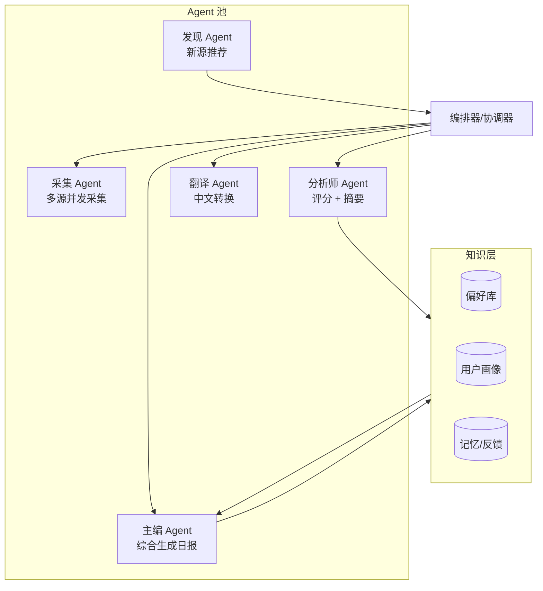
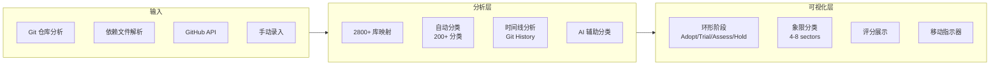
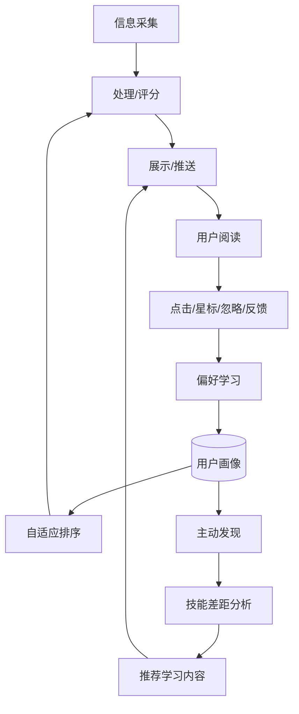
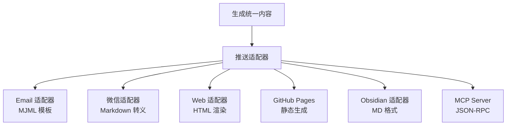

# OhMyInfo — 架构模式深度分析

> 基于 40+ 开源项目的架构逆向工程
> 提取可复用的设计模式、数据流、和组件化方案

---

## 模式 1: 标准 Pipeline 架构

### 1.1 核心流程

```mermaid
flowchart LR
    subgraph Sources["数据源层"]
        RSS[RSS/Atom]
        HN[Hacker News]
        GH[GitHub API]
        RD[Reddit]
        AR[arXiv]
        YT[YouTube]
    end

    subgraph Fetch["采集层"]
        S1["并发采集器"]
        S2["速率控制"]
        S3["健康检查"]
    end

    subgraph Process["处理层"]
        DEDUP["去重<br/>URL + 模糊 + 语义"]
        CLASS["分类<br/>规则 + LLM"]
        SCORE["评分<br/>规则 + ML + LLM"]
        SUMM["摘要<br/>LLM"]
        TRANS["翻译<br/>LLM"]
    end

    subgraph Store["存储层"]
        DB[(SQLite/Postgres)]
        CACHE[(Redis/JSON)]
    end

    subgraph Output["输出层"]
        WEB["Web 仪表盘"]
        MAIL["邮件日报"]
        IM["微信/飞书/钉钉"]
        PAGES["GitHub Pages"]
    end

    Sources --> Fetch
    Fetch --> DEDUP
    DEDUP --> CLASS
    CLASS --> SCORE
    SCORE --> SUMM
    SUMM --> TRANS
    TRANS --> Store
    Store --> Output
```



### 1.2 参考实现

```
Horizon (Thysrael/Horizon):
  fetch/ → deduplicate/ → score/ → enrich/ → summarize/ → deploy/
  7 个独立步骤, 可单独测试和替换

Signal (gmoigneu/signal):
  fetchers/ → dedup/ → llm/ → web/
  FastAPI backend, 每步是独立 service

TechSentry (qingni/TechSentry):
  collector/ → processor/ → reporter/ → notifier/
  模块化设计, 支持 Docker 部署
```

---

## 模式 2: 多智能体协作架构 (Gen 4)

### 2.1 架构示意



### 2.2 参考实现

```
TechStatic Insights (ruslanmv/news-and-trends):
  Agent 1: Senior News Researcher → 筛选排序
  Agent 2: Tech Newsletter Writer → 生成日报
  CrewAI 多 Agent 协作

Signex (zhiyuzi/Signex):
  Sensor Agent → 采集 (15+ 源)
  Lens Agent → 分析 (多视角)
  Vault → 跨 Watch 知识沉淀
  完全在 Claude Code 中运行

OrangeViolin/tech-radar:
  Layer 1: 数据采集 (7 源)
  Layer 2: AI 分析师并行分析 (4 个独立 Agent)
  Layer 3: 主编综合输出
```

---

## 模式 3: Tech Radar 可视化架构

### 3.1 数据流



### 3.2 参考实现

```
Sentinel Feed:
  7 源 → 6 主题扇区 → 3 种视图 (雷达/地图/列表)
  每次采集 15 分钟, Vercel Cron
  
Repodar:
  GitHub 趋势检测 → Breakout Radar → Ecosystem Leaderboard
  双指标 (Momentum + Health)

puneetdixit200/my-bloomburg:
  80+ 源 → 本地 SQLite → Streamlit 仪表盘
  GitHub Radar + Research Radar + Startup Gap Finder
```

---

## 模式 4: 个性化学习闭环架构

### 4.1 反馈循环



### 4.2 参考实现

```
CondenseIt:
  星级评分 → 喜欢/不喜欢词库 → LLM Reranker
  经典分数 (0.3) + LLM 分数 (0.7) 混合排序
  
Devloop:
  代码/Git/Session 扫描 → 7 领域能力图谱 → 50+ 源搜索 → 推荐
  每 2-3 次推荐聚焦最大的能力 gap
  
Signex:
  Watch (监控意图) → Sensor (采集器) → Lens (分析视角) → Vault (知识库)
  用户反馈不断调整分析重点
```

---

## 模式 5: 插件式数据源架构

### 5.1 源注册模式

```typescript
// 统一采集器接口 (参考 Signal 和 Signex)
interface SourceCollector {
  name: string;
  type: 'rss' | 'api' | 'scrape' | 'search';
  
  // 配置
  config: SourceConfig;
  
  // 核心方法
  fetch(): Promise<Article[]>;
  health(): Promise<HealthStatus>;
}

// 注册机制
const registry = new SourceRegistry();
registry.register('hacker-news', new HNCollector());
registry.register('github-trending', new GitHubTrendingCollector());
registry.register('arxiv-cs-ai', new ArxivCollector('cs.AI'));
```

### 5.2 参考实现

```
Signal 的源架构高度可扩展:
  rss.py, hackernews.py, reddit.py, arxiv.py, github.py, youtube.py, bluesky.py
  每个源是独立模块, 统一 CollectResult 接口

Horizon:
  每个源在 sources.yaml 中配置
  支持自定义添加 RSS/Atom 源
```

---

## 模式 6: 多渠道推送架构

### 6.1 推送适配器



### 6.2 参考实现

```
TrendRadar (sansan0):
  支持 7 种推送: 微信/飞书/钉钉/Telegram/邮件/ntfy/bark/slack
  每种推送有独立适配器和模板
  
Horizon:
  GitHub Pages + Email + Webhook + MCP Server
  统一的 Digest 数据模型, 不同渲染器
```

---

## 总结: OhMyInfo 推荐架构

```
OhMyInfo Architecture (MVP → v2.0)
═══════════════════════════════════

Layer 1: 数据源层
  ├── RSS/Atom Feeds (feedparser)
  ├── GitHub Trending (HTML/API)
  ├── Hacker News (Firebase API)
  ├── Reddit (JSON API)
  ├── arXiv (RSS)
  └── Product Hunt (API) [v2]

Layer 2: 采集层
  ├── 并发采集器 (asyncio + httpx)
  ├── 速率限制 (令牌桶)
  ├── 重试机制 (指数退避)
  └── 源健康监控

Layer 3: 处理层
  ├── 去重 (URL → 模糊 → 语义)
  ├── 分类 (规则 → LLM)
  ├── LLM 评分 (0-10, 多维)
  ├── LLM 摘要 (2-3 句)
  ├── 中文翻译 (LLM)
  └── 聚类 (TF-IDF + CosSim) [v2]

Layer 4: 存储层
  ├── SQLite (单机) / PostgreSQL (服务)
  ├── 用户偏好 (JSON)
  ├── 阅读历史
  └── 评分缓存

Layer 5: 个性化
  ├── 关键词偏好 (v1)
  ├── 兴趣画像 (v1)
  ├── 隐式学习 (v2)
  └── 技能图谱 (v3)

Layer 6: 输出层
  ├── Web 仪表盘 (技术雷达 + 日报)
  ├── 邮件日报
  ├── 微信推送 [v2]
  ├── GitHub Pages 存档
  └── MCP Server [v2]
```
